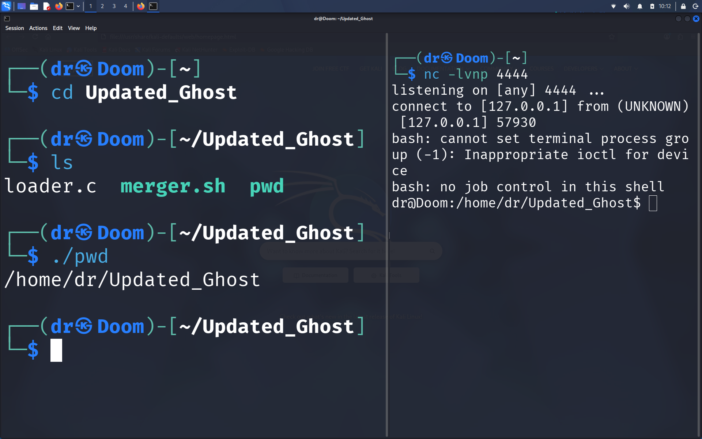

Ghost Binary — Linux Security Research PoC

Ghost Binary is a Linux security research Proof of Concept (PoC) exploring process behavior, local TCP communication, file-descriptor redirection, and executable packaging techniques.

The project was developed as an isolated laboratory exercise to understand how multiple low-level Linux mechanisms can interact within a single program.

Components

loader.c — Demonstrates process creation, session handling, TCP socket setup, file-descriptor manipulation, and execution of a shell.

merger.sh — Demonstrates an executable-packaging workflow that embeds generated binary data into a C source file and produces a combined executable.

local-build/ — Contains locally generated build artifacts and is intentionally excluded from version control.

Concepts Demonstrated

Linux process creation and session management

TCP socket programming

Standard input/output/error redirection

File-descriptor duplication with dup2

Program execution with execve

Linux memory/file-descriptor based execution concepts

Shell scripting and automated compilation

Binary embedding and executable packaging

Git/GitHub project version control

Security Context

This repository is intended for educational security research and controlled laboratory environments.

The techniques demonstrated here can overlap with behaviors observed in malicious software. They should therefore only be studied or tested on systems where the researcher has explicit authorization.

The compiled executable and generated build artifacts are intentionally not included in the public repository.

Project Structure
Ghost_Binary/
├── loader.c
├── merger.sh
├── .gitignore
└── local-build/

Learning Objectives

This PoC was created to gain practical experience with:

Linux system programming

Process and file-descriptor behavior

Network programming in C

Shell scripting

Binary and executable analysis

Security research methodology

Git and GitHub version control

Disclaimer

This project is provided for educational and authorized security research purposes only. Do not execute or test security-related code against systems without explicit permission.

Author

Khushal Gaur

GitHub: Lucifer4x

## Proof of Concept

